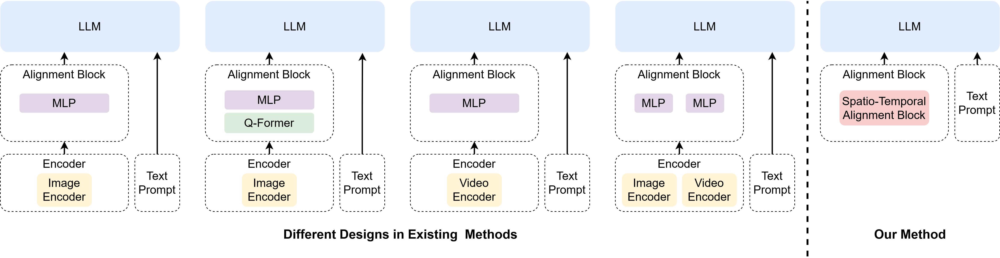
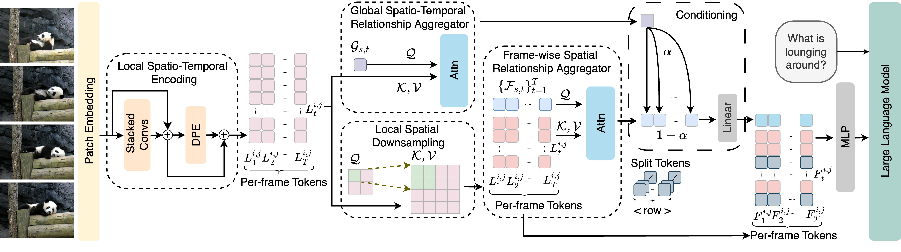
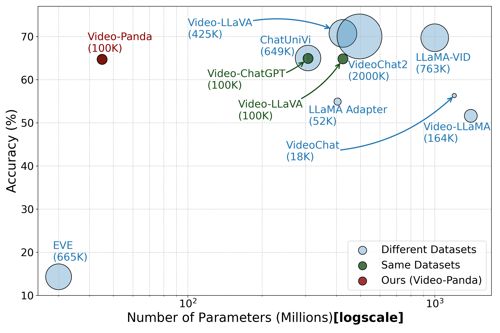

#  Video-Panda: Parameter-efficient Alignment for Encoder-free Video-Language Models [CVPR 2025]

[Jinhui Yi*](https://scholar.google.com/citations?user=kLZxzzUAAAAJ&hl=en),
[Syed Talal Wasim*](https://talalwasim.github.io),
[Yanan Luo*](https://scholar.google.com/citations?user=yuDQY0YAAAAJ&hl=en),
[Muzammal Naseer](https://muzammal-naseer.com),
[Juergen Gall](https://pages.iai.uni-bonn.de/gall_juergen/)

*Equal Contribution

[](https://arxiv.org/abs/2412.18609)
<hr />

> **Abstract:**
>*We present an efficient encoder-free approach for video-language understanding that achieves competitive performance while significantly reducing computational overhead. Current video-language models typically rely on heavyweight image encoders (300M-1.1B parameters) or video encoders (1B-1.4B parameters), creating a substantial computational burden when processing multi-frame videos. Our method introduces a novel Spatio-Temporal Alignment Block (STAB) that directly processes video inputs without requiring pre-trained encoders while using only 45M parameters for visual processing - at least a 6.5$\times$ reduction compared to traditional approaches. The STAB architecture combines Local Spatio-Temporal Encoding for fine-grained feature extraction, efficient spatial downsampling through learned attention and separate mechanisms for modeling frame-level and video-level relationships. Our model achieves comparable or superior performance to encoder-based approaches for open-ended video question answering on standard benchmarks. The fine-grained video question-answering evaluation demonstrates our model's effectiveness, outperforming the encoder-based approaches Video-ChatGPT and Video-LLaVA in key aspects like correctness and temporal understanding. Extensive ablation studies validate our architectural choices and demonstrate the effectiveness of our spatio-temporal modeling approach while achieving 3-4$\times$ faster processing speeds than previous methods.*

## 🚀 News
* **[Feb. 26, 2025]** 💥💥💥 Our Video-Panda has been accepted by CVPR 2025! 💥
* **[Dec. 29, 2024]** 🔥 We release the pretrained and finetuned Video-Panda models. You can download them from [Huggingface](https://huggingface.co/jh-yi/Video-Panda-7B) or [Onedrive](https://1drv.ms/f/s!AsC2VlBnTwa6kd8-2L9hQ9XJioD1NQ?e=6WEPZd). 
* **[Dec. 25, 2024]** 💥 The [Paper](https://arxiv.org/abs/2412.18609) and the [code](https://github.com/jh-yi/Video-Panda) are released. 
<hr />


## 💡 Overview

Video-Panda is an encoder-free video conversation model that directly processes video inputs through a novel spatio-temporal alignment block (STAB). It eliminates the need for heavyweight pretrained encoders and requires less than 50M parameters. 
<p align="center">
  
  <p align="left"><b>Comparison to existing video-language model architectures.</b></p>
</p>

<hr />

<p align="center">
  
  <p align="left"><b>Detailed architecture of our Spatio-Temporal Alignment Block (STAB).</b></p>
</p>

## 🔍 Model Performance and Visualization

<p align="center">
  
  <p align="left">Model performance on MSVD-QA versus the model size of the visual component in logarithmic scale. The bubble size indicates the amount of finetuning data (in thousands). Models using the same training dataset as ours (100K samples) are shown in dark green, while those using different datasets are in blue.</p>
</p>

<hr />

<p align="center">
  
  <p align="left">Qualitative examples showing the impact of removing Frame-wise Spatial Relationship Aggregator (FSRA) and Global Spatio-Temporal Relationship Aggregator (GSTRA).</p>
</p>

## Getting Started

### 🔧 Installation

**1. Prepare the code and the environment**

* Python >= 3.10
* Pytorch == 2.1.0
* CUDA Version >= 11.7
```
git clone https://github.com/jh-yi/Video-Panda
cd Video-Panda
conda create -n videopanda python=3.10 -y
conda activate videopanda

pip install --upgrade pip
pip install -e .
pip install -e ".[train]"
pip install flash-attn==2.6.3 --no-build-isolation
pip install git+https://github.com/huggingface/accelerate.git

export PYTHONPATH="$PYTHONPATH:."
```
**2. Prepare the pretrained models and configs**

We train our model based on [EVE](https://github.com/baaivision/EVE). Download [EVE-7B-Pretrain-v1.0](https://huggingface.co/BAAI/EVE-7B-Pretrain-v1.0) and extract them into `checkpoints/` path. Replace the `checkpoints/EVE-7B-Pretrain-v1.0/config.json` with `videopanda/config/config.json`. 

For evaluation, download the pretrained and finetuned Video-Panda models. You can download them from [Huggingface](https://huggingface.co/jh-yi/Video-Panda-7B) or [Onedrive](https://1drv.ms/f/s!AsC2VlBnTwa6kd8-2L9hQ9XJioD1NQ?e=6WEPZd), and extract them into `checkpoints/` path.

After downloading all of them, organize the models as follows. 

```
checkpoints
├── EVE-7B-Pretrain-v1.0
│   │── config.json -> config.json
│   │── ...
└── Video-Panda-7B
    │── videopanda_fitu
    │   │── config.json
    │   │── ...
    └── videopanda_prtr1
        │── config.json
        │── ...
```

**3. Prepare the datasets**

Video-Panda was trained with Valley-702k dataset and Video-ChatGPT-100k dataset, and was evaluated on four open-ended VideoQA datasets: MSRVTT-QA, MSVD-QA, TGIF-QA, and ActivityNet-QA. Please follow the instructions in [Video-LLaVA](https://github.com/PKU-YuanGroup/Video-LLaVA/blob/main/TRAIN_AND_VALIDATE.md) for downloading the data. 

After downloading all of them, organize the data as follows in ```DATA_ROOT```. 

```Shell
DATA_ROOT
├── train
│  ├── train_json
│  ├── valley
│  └── videochatgpt_tune
└── eval
   └── GPT_Zero_Shot_QA
       ├── Activitynet_Zero_Shot_QA
       ├── MSRVTT_Zero_Shot_QA
       ├── MSVD_Zero_Shot_QA
       └── TGIF_Zero_Shot_QA
```

### 🗝️ Training & Validating

The training & validating instruction is in [TRAIN_AND_VALIDATE.md](TRAIN_AND_VALIDATE.md).


## ❤️ Acknowledgements
Our code is based on [Video-LLaVA](https://github.com/PKU-YuanGroup/Video-LLaVA) and [EVE](https://github.com/baaivision/EVE) repositories. We thank the authors for releasing their code. If you use our model, please consider citing these works as well.

This work was supported by the Federal Ministry of Education and Research (BMBF) under grant no.\ 01IS22094A WEST-AI and the ERC Consolidator Grant FORHUE (101044724). For the computations involved in this research, we acknowledge EuroHPC Joint Undertaking for awarding us access to Leonardo at CINECA, Italy, through EuroHPC Regular Access Call - proposal No.\ EHPC-REG-2024R01-076. 

## ✏️ Citation
If you find our work, this repository, or pretrained models useful, please consider giving a star ⭐ and citation 📝.
```bibtex
@article{yi2024video-panda,
    author    = {Jinhui Yi* and Syed Talal Wasim* and Yanan Luo* and Muzammal Naseer and Juergen Gall},
    title     = {Video-Panda: Parameter-efficient Alignment for Encoder-free Video-Language Models},
    journal   = {arXiv preprint, arXiv:2412.18609},
    year      = {2024},
}
```

## 🔒 License
The content of this project is released under the Apache License 2.0 as found in the [LICENSE](https://github.com/jh-yi/Video-Panda/blob/main/LICENSE) file.

---
If you have any questions, please create an issue on this repository or contact at jinhui.yi@uni-bonn.de and swasim@uni-bonn.de.
